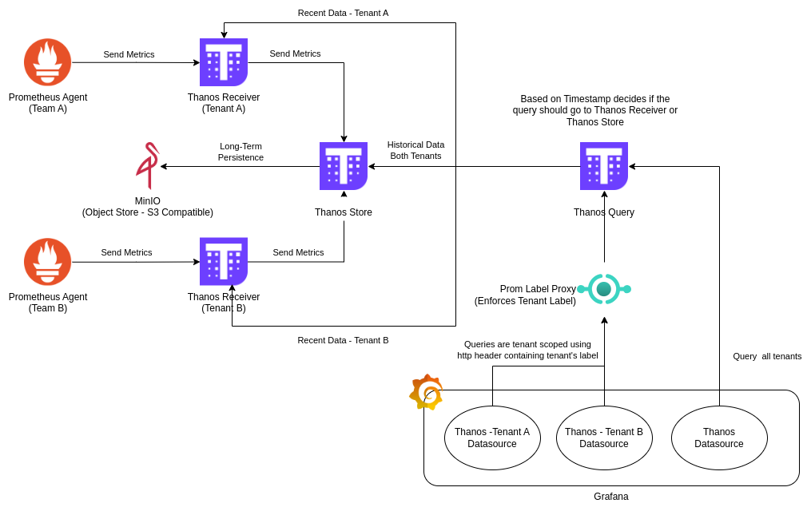
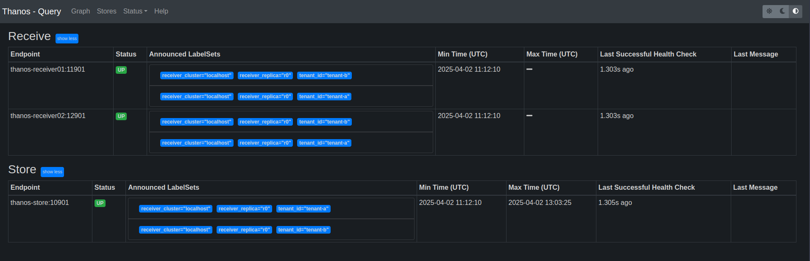
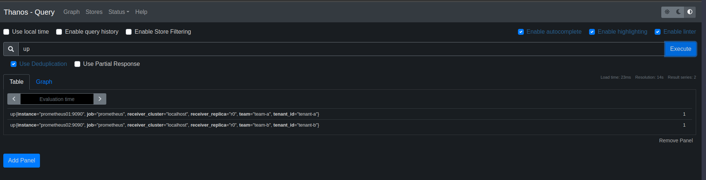
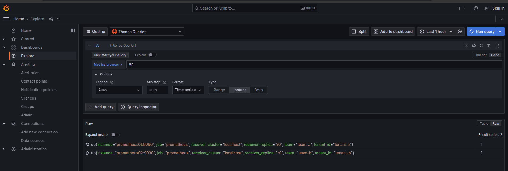
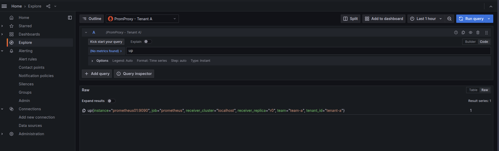
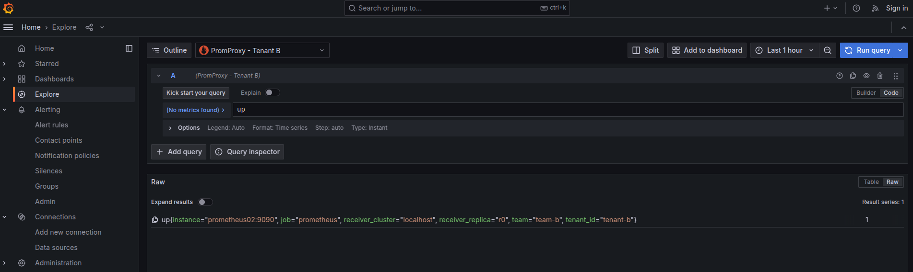

# Thanos Multi-Tenancy (PoC)

## Overview
---

Thanos multi-tenancy enables the isolation of metric data between different users or teams while using a shared infrastructure. This Proof of Concept (PoC) demonstrates how to set up a Thanos-based multi-tenant monitoring system with Prometheus, Thanos Receiver, Thanos Store, Thanos Query, Prom Label Proxy and Grafana.

## Objectives
---

- Enforce per-tenant metric isolation using Thanos Receiver and Query components.
Restrict access to tenant-specific data using Prom Label Proxy.

- Enable cross-cluster aggregation while maintaining multi-tenancy.

- Provide a scalable and cost-efficient monitoring solution for multiple tenants.

## Architecture
---



## Components
---

1. Prometheus: Collects and sends per-tenant metrics to Thanos Receiver.

2. Thanos Receiver: Ingests remote writes and applies tenant separation.

3. Thanos Store: Stores long-term metrics in object storage (MinIO or S3).

4. MinIO: Provides object storage for Thanos Store (can be replaced with AWS S3 or Google Cloud Storage).

5. Thanos Query: Enables querying of tenant-specific data.

6. Prom Label Proxy: Restricts query access based on tenant labels.

7. Grafana: Provides visualization with multi-tenancy support.

## Setup
---

- [Install Docker](https://docs.docker.com/engine/install/ubuntu/)
- [Install Docker-Compose](https://docs.docker.com/compose/install/)

## Running
---

In order to run the application follow those steps:

1. Run Docker Compose
---
```bash
docker compose up -d
```

2. Access Grafana on `localhost:3000` and explore your data using the `PromProxy - Tenant A`, `PromProxy - Tenant B` and `Thanos Querier` datasource. Here is an example of query
```
up()
```

## Results
---

- Thanos Query - Stores


- Thanos Query - Results


- Grafana - Explore - Thanos Query


- Grafana - Explore - PromProxy Tenant A


- Grafana - Explore - PromProxy Tenant B


- Demo
